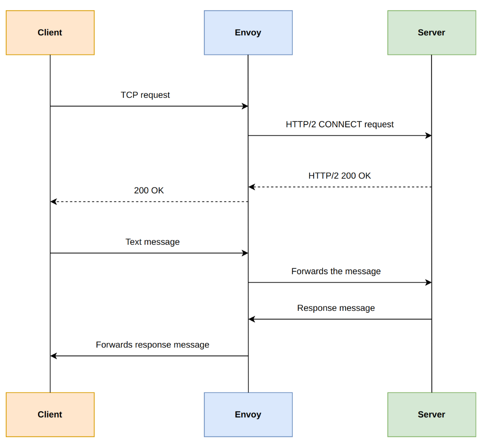
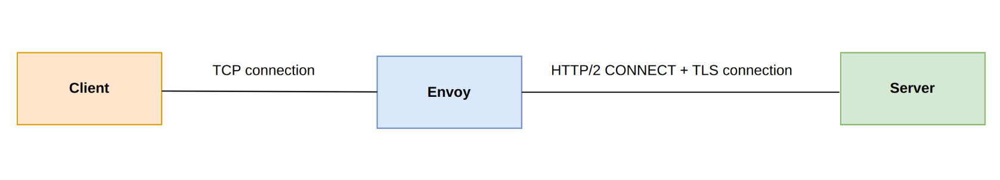
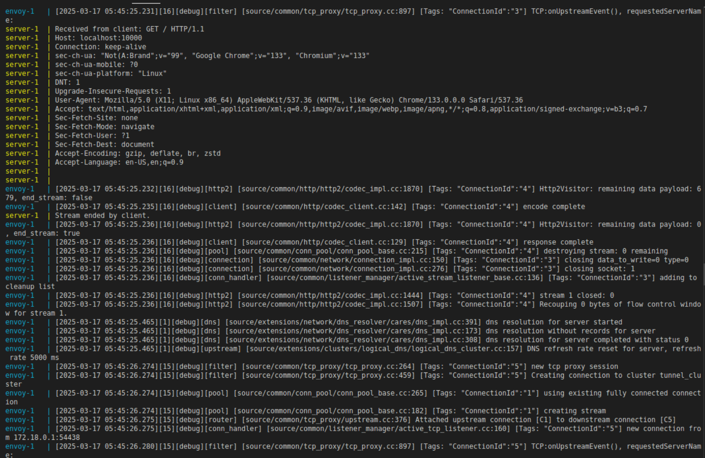
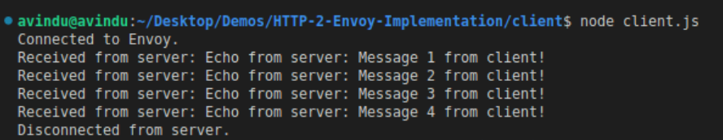

# Client server demonstration using HTTP/2 CONNECT tunnels

This demonstration that shows build a connection between a client and a server to exchange data.

In this demonstration HTTP/2 CONNECT method used to build the HTTP/2 + TLS enabled secure tunnel to sends the requests to the envoy proxy and it pushes the requests to the server to receive responses from the server.






## What is HTTP/2 CONNECT 
HTTP/2 CONNECT method is a core technology for creating tunnels that enable transparent traffic interception and forwarding. HTTP/2 CONNECT tunnel is a powerful tool that can create an efficient tunnel in an existing HTTP/2 connection for transmitting raw TCP data.
## Prerequisites

 - [Install Node.js](https://nodejs.org/en/download)
 - [Install docker](https://docs.docker.com/desktop/)
 - [Install docker compose](https://docs.docker.com/compose/)

Above Prerequisites depends on the operating-system and if any alternative ways to have docker in the setup.


## Demo setup

1. Create the root directory

```bash
 mkdir HTTP/2_CONNECT_Implementation
```
2. Create the certs directory to store SSL keys and certs.

```bash
 mkdir certs
```

- Add this openSSL.cnf file inside the certs directory

```bash
//openSSL.cnf

[ req ]
default_bits       = 2048
default_md         = sha256
prompt             = no
distinguished_name = dn
req_extensions     = req_ext

[ dn ]
C            = US
ST           = California
L            = San Francisco
O            = My Company
OU           = My Division
CN           = server

[ req_ext ]
subjectAltName = @alt_names

[ alt_names ]
DNS.1   = server
DNS.2   = localhost

```
3. Execute the following command to generate the key and cert.

```bash
 openssl req -x509 -nodes -days 365 -newkey rsa:2048 \
  -keyout server.key -out server.crt -config openssl.cnf
```

4. Create client directory
```bash
cd ..

mkdir client

```
5. Create client.js file inside client directory

- The client establishes a standard TCP connection with Envoy and sends text messages.

- The existence of this client is only to trigger Envoy to establish a tunnel with the server.

```bash
//client.js

const net = require('net');

// Builds the TCP connection between client and envoy proxy
const client = net.createConnection({ port: 10000 }, () => {
  console.log('Connected to Envoy.');

  // Send messages to the server through HTTP/2 CONNECT tunnel
  let counter = 1;
  const interval = setInterval(() => {
    const message = `Message ${counter} from client!`;
    client.write(message);
    counter += 1;
  }, 1000);

  // Close the connection
  setTimeout(() => {
    clearInterval(interval);
    client.end();
  }, 10000);
});

client.on('data', (data) => {
  console.log(`Received from server: ${data.toString()}`);
});

client.on('end', () => {
  console.log('Disconnected from server.');
});

client.on('error', (err) => {
  console.error('Client error:', err);
});
```

6. Create server.js file and Dockefile the inside server directory

- It listens for the secureConnection event to process TLS-secured sockets.

- The server reads incoming data from the socket, processes client messages, and sends responses.

```bash
cd ..

mkdir server.js
```

```bash
const http2 = require('http2');
const fs = require('fs');

const server = http2.createSecureServer({
    //Ensuring keys and certs for the secure connection
  key: fs.readFileSync('/certs/server.key'),
  cert: fs.readFileSync('/certs/server.crt'),
});

server.on('stream', (stream, headers) => {
  const method = headers[':method'];
  const path = headers[':path'];

  if (method === 'CONNECT') {
    console.log(`Received CONNECT request for ${path}`);

    // 200 OK status establishing the tunnel
    stream.respond({
      ':status': 200,
    });

    // Handle data within the tunnel
    stream.on('data', (chunk) => {
      const message = chunk.toString();
      console.log(`Received from client: ${message}`);

      // Respond to the client as an echo message 
      const response = `Echo from server: ${message}`;
      stream.write(response);
    });

    stream.on('end', () => {
      console.log('Stream ended by client.');
      stream.end();
    });
  } else {
    // Return 404 for non-CONNECT requests
    stream.respond({
      ':status': 404,
    });
    stream.end();
  }
});

// Start the server and listen on port 8080
server.listen(8080, () => {
  console.log('Secure HTTP/2 server is listening on port 8080');
});
```

```bash
//Dockerfile
FROM node:14

WORKDIR /app

COPY server.js .

EXPOSE 8080

CMD ["node", "server.js"]
```
7. Configure envoy proxy

```bash
cd ..
```
- Create envoy.yaml file in the root directory
    
- Envoy proxy needs to configure to accept TCP connections from client and forward data through CONNECT tunnel to the server

8. Create docker-compose.yaml inside the root directory

- Allows envoy proxy and server operate in the same docker environment facilitates a seamless connection.

- It will orchestrate envoy proxy and server to deploy the required services

```bash

services:
  envoy:
    image: envoyproxy/envoy:v1.32.1
    volumes:
      - ./envoy.yaml:/etc/envoy/envoy.yaml
      - ./certs:/certs  # Mounts the certificates created directory
    ports:
      - "10000:10000"
    networks:
      - envoy_network
    depends_on:
      - server
    command: /usr/local/bin/envoy -c /etc/envoy/envoy.yaml --service-cluster envoy --log-level debug

  server:
    build:
      context: ./server
    networks:
      - envoy_network
    expose:
      - "8080"
    volumes:
      - ./certs:/certs  # Mounts the certificates created directory

networks:
  envoy_network:
```


## Run and test the Demo

1. Open a new terminal from root directory

```bash
  docker-compose up --build
```
- This terminal shows client and server startup information and HTTP/2 secured server listening on port 8080




2. Open a new terminal 

- Execute following commands to start the client

```bash
  cd client

  node client.js
```



## Clone the repo and Test

1. Clone this repo to your local machine
```bash
git clone <repo_url>

```

2. Execute the below given docker-compose command in the root directory terminal

```bash
docker-compose up --build
```
3. Move to the client directory and start the client

```bash
cd client

node client.js
```
